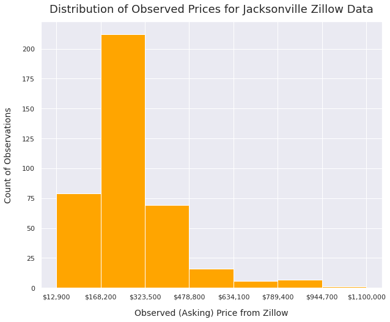
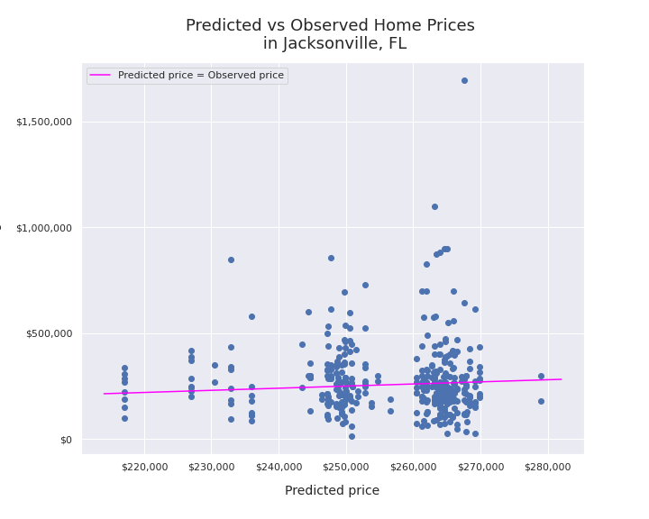
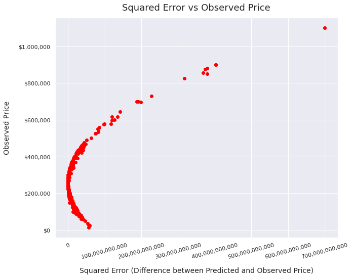
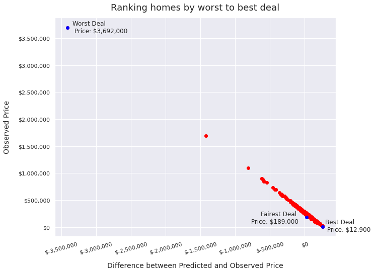

## Project 1 write-up


#### Selected location: 

Jacksonville, FL

#### Data
* I initially scraped 400 observations, but 8 observations failed to scrape the square footage from the website and were dropped, so the data I used in the model ultimately contained 392 observations. 
* Descriptive statistics:

|measure  |  prices | no_beds   |    baths    |     sqft |
|------|----------|-------------|-----------|--------|
|count | 392    |    392 | 392 | 392 |
|mean |  $285,009    |      3.525  |  2.515 | 1988.882 |
|std  |  $242,487      |    0.848 |   0.718  | 693.0126 |
|min  |  $12,900      |     2  |  1 | 989.0 |
|25%  |  $178,675     |     3  |  2 | 1439.0 |
|50%  |   $249,100   |       4  |  2 | 1827.5 |
|75%  |  $326,000    |      4  |  3 | 2440.0 |
|max  |  $3,692,000    |     5  |  5 | 3621.0 |

Initial distribution of home prices:

(excludes outliers)



#### Description of model architecture
* I kept my model pretty simple, which probably contributed to its poor level of accuracy in making predictions. It takes number of bedrooms, number of bathrooms, and square footage (scaled down by a factor of 1000) as inputs, and then uses the same model architecture we have been using for most of our examples in class:

``` 
df['sqft'] = df['sqft']/1000
# number of bedrooms:
x1 = np.array(df['no_beds'], dtype = float)
# square footage (divided by 1000):
x2 = np.array(df['sqft'], dtype = float)
# number of bathrooms:
x3 = np.array(df['baths'], dtype = float)
# combine the arrays
xs = np.stack([x1, x2, x3], axis = 1)
# price:
ys = np.array(df['prices'], dtype = float)

model = tf.keras.Sequential([keras.layers.Dense(units=1, input_shape=[3])])
model.compile(optimizer = 'sgd',loss='mean_squared_error')
model.fit(xs, ys, epochs= 500)

```

#### Analysis of model output
* My model was honestly not that good. The mean squared error for the predictions was very high, at 58,743,084,732 across all observations. The mean absolute error was 126,914.
In other words, on average my model was off by about $127K, which is a pretty significant margin since the mean home price in my dataset was $285,009. 

* Observed versus predicted home prices:

(excludes outliers)




* Model performance seemed to worsen as prices increased:



#### Analysis of the output that assesses and ranks all homes from best to worst deal

I think the homes that are the "worst deal" will be the ones that are much more expensive than the predicted price. Therefore the homes for which the difference between predicted and observed price is both negative (i.e. predicted price is lower than the actual price) and large are the worst deal, and the homes for which the difference between predicted and observed is large and positive will be the best deals. 

In this graph, I show the difference between predicted and observed price, as compared to the observed price. I highlight the best, worst, and fairest deals in my dataset. The best deal is the house for which the predicted value was the highest above the observed value. The worst deal is the house for which the predicted value is the lowest below the observed value. The fairest deal is the house for which the difference between the predicted and observed value is closest to the median. 



