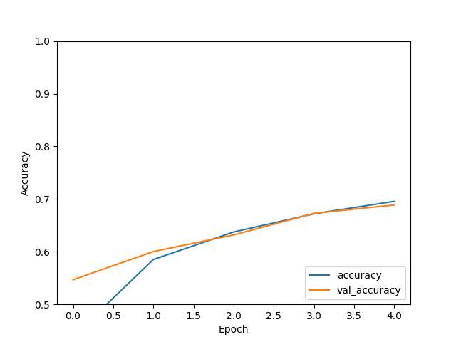
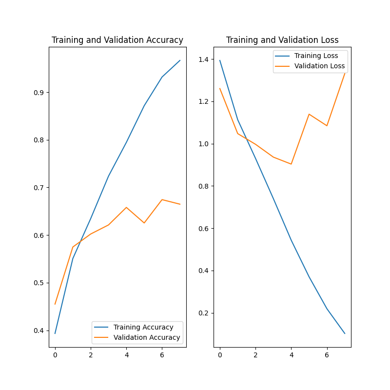

### Class notes April 21

#### script 1: CNN

Script ran successfully

Accuracy plot:



```
>>> print(test_acc)
0.6887999773025513
```

#### script 2: image classification

Script ran successfully

Validation plot:



Data Augmentation output:


