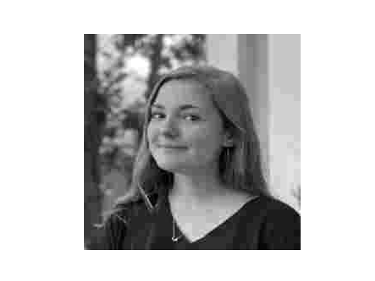
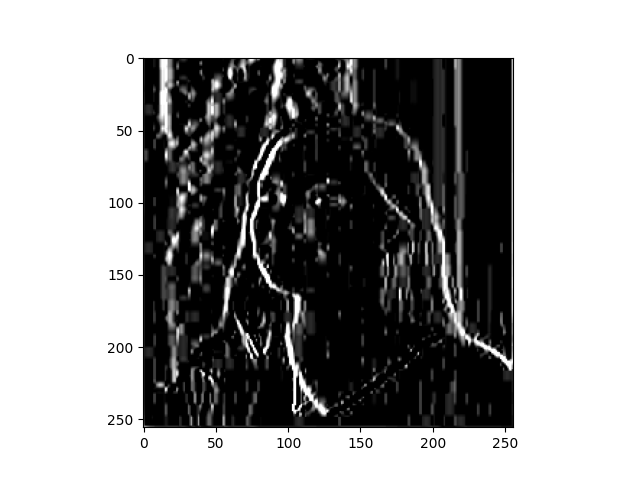

## Homework from class on Feb 17
### Based on Laurence Moroney lecture 3

Last time you did an exercise (convolutions and pooling) where you manually applied a 3x3 array as a filter to an image of two people ascending an outdoor staircase. 
Modify the existing filter and if needed the associated weight in order to apply your new filters to the image 3 times. 
Plot each result, upload them to your response, and describe how each filter transformed the existing image as it convolved through the original array and reduced the object size.

* Filter one
    * This filter seemed like it really emphasized vertical lines, much like the filter in the moroney video, but this one also really emphasized the diagonal lines, along the fence in the left side of the image. The horizontal lines of the fence at the top of the image are very under-emphasized, to the point that they have almost disappeared. 

``` 
filter1 = [ [-2, -2, -2], [0, 0, 0], [2, 2, 2]] 
```


* Filter two
    * This filter behaved similarly to filter one. It has the same numbers as filter one, but I swapped the signs of the first array and the last array, to see if making the numbers positive/negative affected the output of the filter. The plots of the two images for filter 1 and 2 are almost identical, although filter 1 seems to have emphasized the vertical and diagonal lines even more than filter 2. 

```
filter2 = [ [2, 2, 2], [0, 0, 0], [-2, -2, -2]]
```


* Filter three
    * For this filter, I wanted to see what would happen if I left the middle value in each array as zero. This filter did not emphasize the vertical or diagonal lines as much as filter 1 and 2 did, but it also didn't particularly emphasize the horizontal lines either. In general, the output of the image using the filter was much darker than the other filters. 

```
filter3 = [ [2, 0, 2], [1, 0, -1], [-2, 0, -2]]
```


What are you functionally accomplishing as you apply the filter to your original array (see the following snippet for reference)? 

* I think as you apply the filter, which is an array containing 3 sub-arrays, you're basically creating a 3x3 box of cells, with different values in each cell. The values in these cells are applied to each pixel in the input image, so as the box passes over each pixel, the pixel is multiplied by the value in the middle of the 3x3 box, and its neighbor pixels are multiplied by the values in the location of the box that they represent to the center pixel. As the filter moves over each pixel and multiplies its neighbors by the values in the filter, the pixel values are stretched in different ways that may make one type of feature or another become more or less emphasized in the output image. 

Why is the application of a convolving filter to an image useful for computer vision? 

* I think the goal of the convolving filter is first to make the image easier for the computer to process, by increasing the contrast between features that might be most important for the computer to recognize. It helps to extract features that are relevant and wash out features that are irrelevant.

**Stretch goal:**

Instead of using the misc.ascent() image from scipy, can you apply three filters and weights to your own selected image? Again describe the results.

* input image:


* first I had to reduce the quality and convert the image to greyscale:



* Filter 4:
    * I applied this filter to see what would happen if I didn't weight the filter so that all the values added up to one. I know that's what you're supposed to do but I wanted to know what the output would look like if the values added up to more than one. The output is extremely whitewashed, I think because the pixels that the filter passed over all got the pixel values increased, across the board, without any weighting to normalize the values back closer to zero.  

```
filter4 = [ [0, 1, 0], [1, 1, 1], [0, 1, 0]]
```


* Filter 5:
    * I applied this filter to see if it would emphasize vertical lines at all. It didn't really do what I expected it to. The output image 
is pretty dark, and the filter seems to have emphasized some of the leaves in the background of the picture, as well as my eyes and forehead. The output image in general just looks like something out of a horror movie. 

```
filter5 = [ [-1, 0, 1], [-2, 0, 2], [-1, 0, 1]]
```


* Filter 6:
    * I applied this filter again to see if it would emphasize vertical lines, because only the middle values in each array are non-zero. This filter also didn't really do what I expected, and the output image is very dark. It seems like almost all the pixels have been zeroed out, except a very thin outline of the left side of my face. It seems like, generally speaking, when the filters contain mostly zeroes, the output image will be pretty dark, and when the filter contains higher values, the output image is brighter. 

```
filter6 = [ [0, 1, 0], [0, -2, 0], [0, 1, 0]]
```


Another useful method is pooling. Apply a 2x2 filter to one of your convolved images, and plot the result. 

* I applied filter 1 to the image of my face, and then pooled it using a 2x2 filter:



In effect what have you accomplished by applying this filter? 

* This filter basically created 2x2 boxes that look at 4 pixels at a time. It chooses the largest value from each 2x2 box, so the output is 1/4 the size of the original, but the largest values are preserved.

Does there seem to be a logic (i.e. maximizing, averaging or minimizing values?) associated with the pooling filter provided in the example exercise (convolutions & pooling)? 

* The filter uses the code `for x in range(0,size_x,2):` in the for loop, which means that it is iterating over the pixels but skipping every other pixel (because the step is 2). So it creates an empty image which is half the x and half the y of the original using line `new_x = int(size_x/2)` and `new_y = int(size_y/2)` and then populates the image with only half the pixels from the original image. For this strategy, there doesn't seem to be much logic. It's basically choose randomly which pixels to keep or not. 

Did the resulting image increase in size or decrease? Why would this method be useful? 

* The resulting image decreased in size. This is useful because it means that there is less information to process, so the computer can operate more efficiently/ save processing power. 

**Stretch goal:**

Again, instead of using misc.ascent(), apply the pooling filter to one of your transformed images.


Convolve the 3x3 filter over the 9x9 matrix and provide the resulting matrix.

* The resulting matrix is:
```array([[0, 0, 0, 0, 1, 0, 0, 0, 0],
       [0, 0, 0, 1, 1, 1, 0, 0, 0],
       [0, 0, 0, 1, 1, 1, 0, 0, 0],
       [0, 0, 0, 1, 1, 1, 0, 0, 0],
       [1, 3, 3, 3, 3, 3, 3, 3, 1],
       [0, 0, 0, 1, 1, 1, 0, 0, 0],
       [0, 0, 0, 1, 1, 1, 0, 0, 0],
       [0, 0, 0, 1, 1, 1, 0, 0, 0],
       [0, 0, 0, 0, 1, 0, 0, 0, 0]])
       ```
