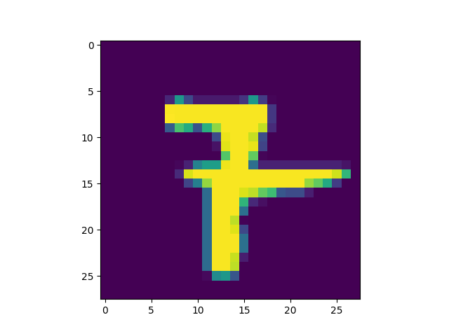
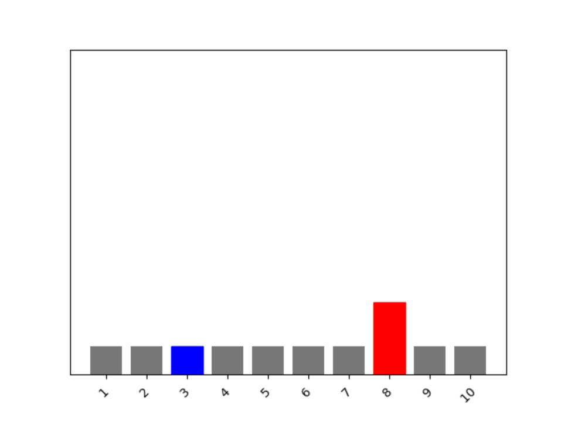

### For class on 2/8/21
#### (updated 2/10/21)

1. In the video, First steps in computer vision, Laurence Maroney introduces us to the Fashion MNIST data set and using it to train a neural network in order to teach a computer “how to see.” One of the first steps towards this goal is splitting the data into two groups, a set of training images and training labels and then also a set of test images and test labels. Why is this done? What is the purpose of splitting the data into a training set and a test set?
- The images are split into two sets because the neural net is trained on a subset of the images, and then the rest of the images are used to test the network on how well it guesses the categories of images it has never seen before. The purpose is to give us an estimation of how well our model performs. 

2. The fashion MNIST example has increased the number of layers in our neural network from 1 in the past example, now to 3. The last two are .Dense layers that have activation arguments using the relu and softmax functions. What is the purpose of each of these functions. Also, why are there 10 neurons in the third and last layer in the neural network.
- The Flatten layer takes the input 28x28 rectangular shape of the data and changes it into a one dimensional array that can then be processed by the other functions
- The relu function dictates that if the output of a neuron is less than zero, set it to zero
- The softmax function helps to find the most likely class by setting the class with the highest probability to 1, and setting all other classes to zero
- In the Dense layer with 10 neurons, the 10 neurons represent the 10 classes that the clothing images can be categorized as.

3. In the past example we used the optimizer and loss function, while in this one we are using the function adam in the optimizer argument and sparse_categorical- crossentropy for the loss argument. How do the optimizer and loss functions operate to produce model parameters (estimates) within the model.compile() function?
- The loss function calculates how good or how bad the answer (given by all the neurons' guesses added up), and the optimizer "tweaks" the parameters of the neurons to give it another try. Over a series of attemps, the estimates for the training data will be fit to be as accurate as possible to the labels of the training data. 

4. Using the mnist drawings dataset (the dataset with the hand written numbers with corresponding labels) answer the following questions.
What is the shape of the images training set (how many and the dimension of each)?
- (60000, 28, 28)
- There are 60,000 images and each image is 28 by 28

5. What is the length of the labels training set?
- 60,000

6. What is the shape of the images test set?
- (10000, 28, 28)
- There are 10,000 images and each is 28 by 28

7. Estimate a probability model and apply it to the test set in order to produce the array of probabilities that a randomly selected image is each of the possible numeric outcomes (look towards the end of the basic image classification exercises for how to do this — you can apply the same method applied to the Fashion MNIST dataset but now apply it to the hand written letters MNIST dataset).
Use np.argmax() with your predictions object to return the numeral with the highest probability from the test labels dataset.
- I randomly chose the image at index 97

```
classifications = model.predict(test_images)

print(classifications[97])

>>> [6.1059264e-14 2.8641389e-06 8.3220975e-06 7.9902960e-04 1.3495819e-08 5.7034008e-14 1.5956934e-33 9.9918967e-01 6.7410788e-08 1.1945669e-08]
 
np.argmax(classifications[97])

>>> 7
```

8. Produce a plot of your selected image and the accompanying histogram that illustrates the probability of that image being the selected number




