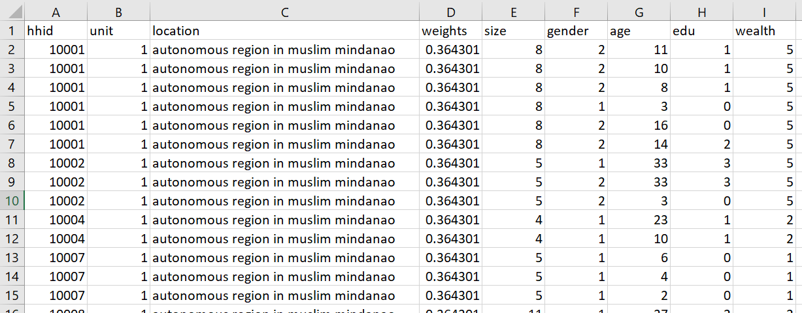
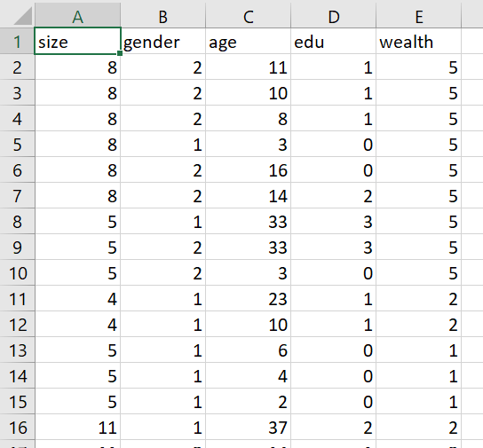
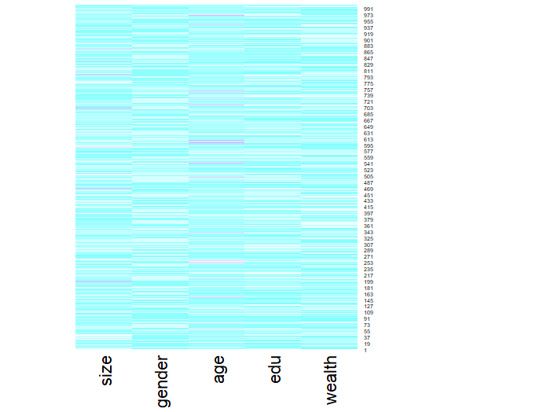

## Informal responses from March 10

#### Import the households dataset for your selected country and create a data frame with a variable that describes each of the following: household ID, unit, weights, location, size, gender, age, education, wealth

output:



#### Pivot the persons columns within your households data to a long format in order to produce a similarly specified dataset that describes all persons residing within all households. Using this data frame describing all persons standardize, normalize and percentize your variables and visualize each post transformed dataset as a heatmap that illustrates the heterogeneity of the combination of patterns.

- pns dataframe:



- Heatmaps in progress, having issues with heatmaply
- Still can't get heatmaply to work, still getting the following error despite trying Caroline's workaround:
``` 
Error in hclustfun(dist) : must have n >= 2 objects to cluster
```
- I instead tried to create the heatmap using the basic heatmap function in R:
``` 
pns_prep <- slice_sample(pns, n = 1000, replace = FALSE)
pns_matrix <- data.matrix(pns_prep)
pns_heatmap <- heatmap(pns_matrix, Rowv=NA, Colv=NA,
                       col = cm.colors(256), scale="column", margins=c(5,10))
png(file = "pns_heatmap1.png")
heatmap(pns_matrix)  
dev.off() 
```
which produced the following plot:


